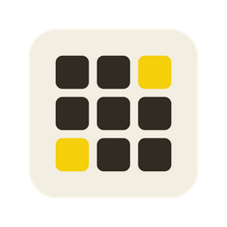
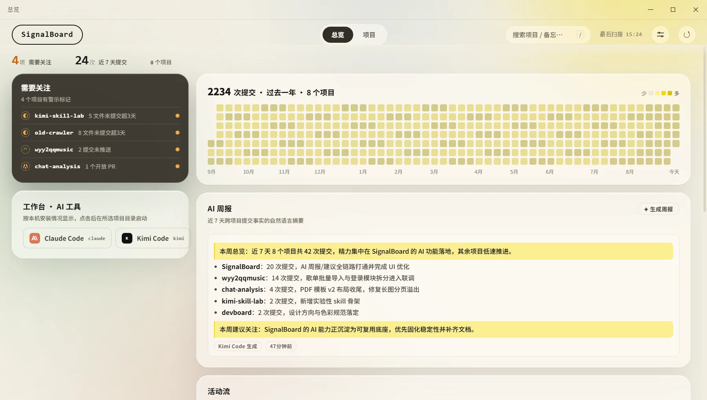
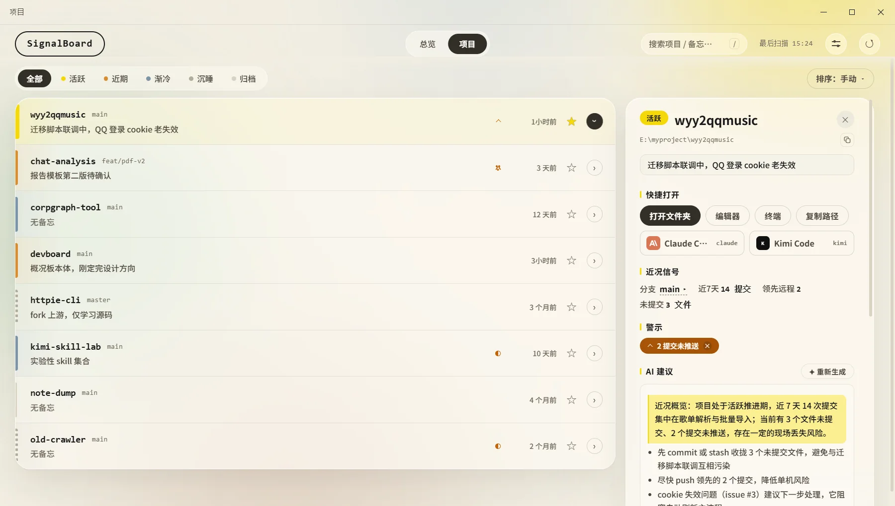
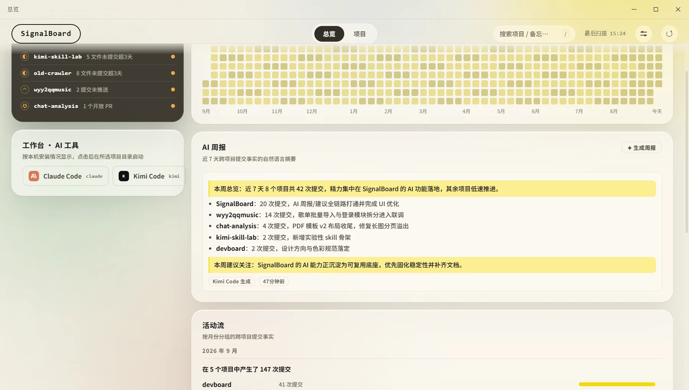
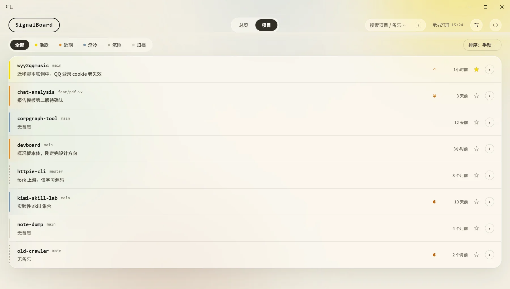
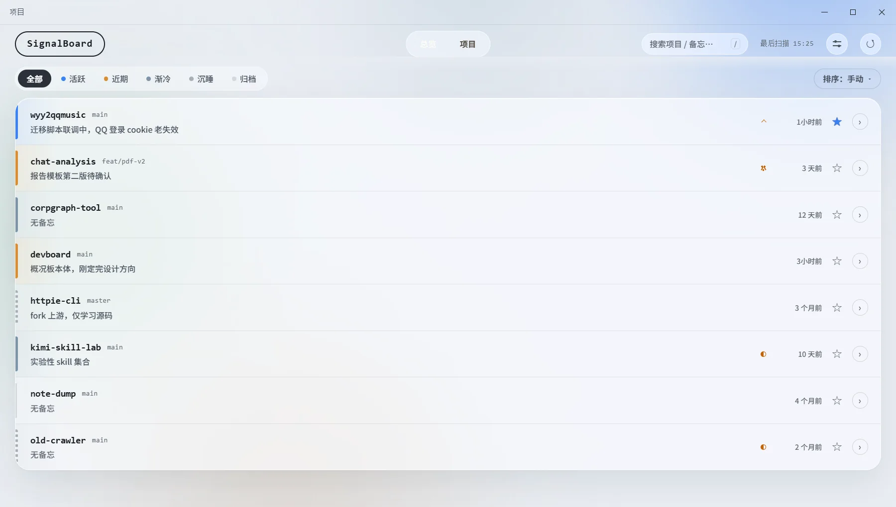
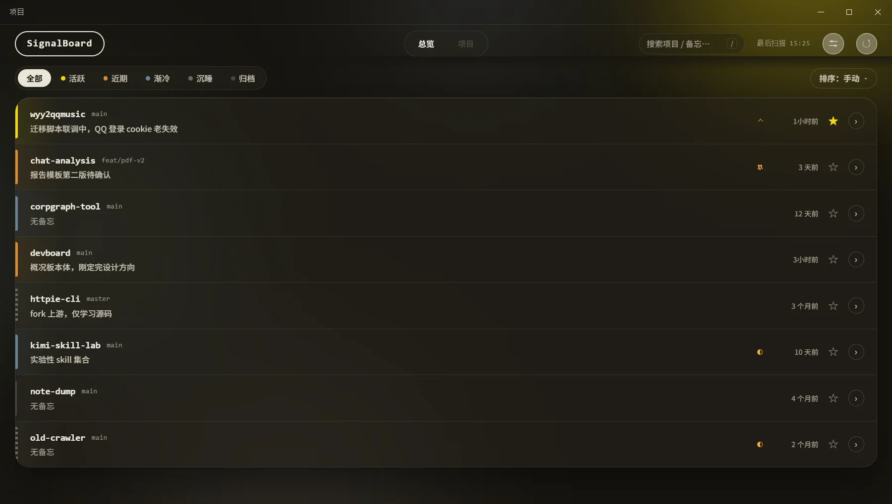
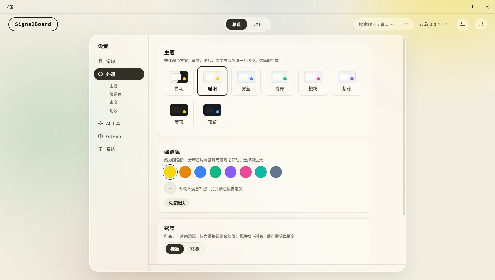

<p align="center">
  
</p>

<h1 align="center">SignalBoard · 信号板</h1>

<p align="center">
  散落在各处的项目，一处看清近况。<br>
  Your scattered projects, one glance away.
</p>

<p align="center">
  <a href="https://github.com/Yaemikoreal/devboard/releases"></a>
  <a href="LICENSE"></a>
  
  
</p>

<p align="center">
  <a href="https://yaemikoreal.github.io/devboard/">官网 Website</a> ·
  <a href="#中文">中文</a> ·
  <a href="#english">English</a>
</p>

---

<a id="中文"></a>

SignalBoard 是一个本地桌面端项目概况板：在众多并行的 vibecoding 项目中，自动聚合各项目的事实近况（提交、改动、AI 会话痕迹、GitHub issues/PR），帮你快速回忆起「每个项目做到哪了」。核心是**事实聚合**，不是项目管理平台——零维护、零填表，数据只存本机。

托盘常驻，`Ctrl+Shift+D` 一按即见；唤出时主动重扫，后台每 20 分钟静默刷新，看到的永远是新数据。

<p align="center">
  
</p>

## 功能

**总览：跨项目的事实全貌**

- 全年提交热力图：所有项目提交按天求和，一年节奏一眼看全
- 按月活动流：每月哪些项目在动、动了多少次，成条对比
- 「需要关注」固定位：超期未提交 / 未推送 / 开放 PR 按严重度排序，点击直达详情
- AI 周报：近 7 天提交节奏一段人话总结，打开即有，当天缓存复用
- 工作台：本机装了的 AI 命令行工具自动现身，一键在项目目录启动

**项目页：行式列表，按温度分带**

- 五档活跃分带：活跃 ≤3 天 / 近期 4–7 天 / 渐冷 8–30 天 / 沉睡 31–90 天 / 归档 90 天+，按最后动静自动划分——提交、AI 会话、未保存改动都算「动静」
- 行内即见分支、备忘、警示与最近动静；拖拽排序与图钉置顶，位序持久化
- 搜索按名称与备忘过滤，`/` 聚焦、回车直达；无补全选中项时回车按自然语言筛选


**详情面板：一个项目的全部近况**

- README 摘要、近期提交、未提交文件、月份热力图，点开即回到上下文
- AI 建议：按项目 git 信号给 2–3 条下一步行动，随项目缓存
- 备忘钉在项目最显眼处，防止决策漂移；警示可消音，底层状态变了自动复出
- 快捷打开：文件夹 / 编辑器 / 终端 / AI 工具，一键到位；各本地分支数据可切换查看



**AI 能力：用你本机已装的 AI 工具**

调用本机已登录的 Agent CLI（claude / codex / kimi / grok 或自定义命令），只发统计事实与提交文本，**不上传代码**；首选引擎失败自动链式回退，可整体关闭，未安装时入口自动隐藏。



**主题与个性化**

七套整体主题（暖阳 / 雾蓝 / 青野 / 樱粉 / 紫藤 / 暗夜 / 夜幕，含两套深色），可跟随系统自动明暗切换；强调色可预设可自定义，热力图与分带随之联动；密度两档，可降低动效。

<p>
  
  
  
  
</p>

## 安装

- **安装包**：前往 [Releases](https://github.com/Yaemikoreal/devboard/releases) 下载 `SignalBoard-Setup-x.y.z.exe`，安装即用（Windows）
- **从源码运行**：

```bash
git clone https://github.com/Yaemikoreal/devboard.git
cd devboard
npm install   # 安装依赖（electron，约 100MB）
npm start     # 启动：托盘常驻，Ctrl+Shift+D 唤出/隐藏
```

## 设置一览

顶栏齿轮进入设置，更改即时生效、自动保存：

- **常规**：多个扫描根目录（递归发现含 `.git` 的目录，深度上限 4）、补充路径、黑名单、扫描预览
- **外观**：七套主题 + 跟随系统、强调色预设/自定义、密度、动效
- **AI 工具**：AI 功能总开关、默认引擎、自定义工具清单（按 PATH 探测显隐）
- **GitHub**：设备码授权（推荐）/ 从 gh CLI 导入 / 手动 token；token 经系统 safeStorage 加密落盘，不落明文
- **系统**：编辑器/终端命令、全局热键（默认 `Ctrl+Shift+D`）、开机自启

## 数据与隐私

全部数据在 Electron userData 目录（`%APPDATA%/SignalBoard/`），不出本机：设置、备忘、位序与偏好、GitHub/扫描/AI 缓存分文件存放。GitHub token 加密存储；AI 只发送统计事实与提交信息文本。备忘与偏好可导出/导入为单个 JSON（token 不随包迁移）。

## 开发

```bash
npm run test:scan  # 不起界面，直接跑项目扫描并打印 JSON
npm run shot       # 隐藏窗口渲染真实数据后截图到 screenshot.png
npm run logo       # 从 assets/logo/draft-d.svg 重渲全套图标（托盘用简化稿 draft-d-tray.svg）
```

领域语言与边界见 [CONTEXT.md](CONTEXT.md)，官网源码在 [site/](site/)。

## 已知取舍

- 「脏文件超 3 天」是近似：git 无法给出脏文件起始时间，用最后提交时间近似判断
- GitHub 集成仅覆盖 owner 是使用者的仓库；未配置 token 时对应区域显示占位
- 完全无动静（无提交、无 AI 会话、无未提交改动）的项目落入「归档」

---

<a id="english"></a>

# SignalBoard

SignalBoard is a local desktop project board: across your many parallel vibecoding projects, it automatically aggregates factual recency — commits, uncommitted changes, AI session traces, GitHub issues/PRs — so you can instantly recall *where each project left off*. It is **fact aggregation**, not a project-management platform: zero maintenance, zero data entry, and all data stays on your machine.

It lives in the tray; press `Ctrl+Shift+D` and it's there. Showing the window triggers a rescan, and a silent refresh runs every 20 minutes, so the data is always fresh.

## Features

**Overview: cross-project facts at a glance**

- Year-long commit heatmap summing all projects per day
- Monthly activity stream: which projects moved, and how much
- Pinned "Needs Attention" list ranked by severity (stale uncommitted > unpushed > open PRs), one click to detail
- AI weekly summary of the last 7 days, ready on launch, cached for the day
- Workbench: locally installed AI CLIs appear automatically, launch into a project directory with one click

**Board: row list banded by temperature**

- Five activity bands by last activity: Active ≤3d / Recent 4–7d / Cooling 8–30d / Dormant 31–90d / Archived 90d+ — commits, AI sessions, and unsaved changes all count as activity
- Branch, memo, warnings, and latest activity inline; drag to reorder, pin to focus, order persists
- Search filters by name and memo; `/` focuses, Enter jumps; with no completion selected, Enter filters by natural language

**Detail panel: everything about one project**

- README summary, recent commits, uncommitted files, monthly heatmap — reopen and you're back in context
- AI advice: 2–3 next actions from the project's git signals, cached per project
- A memo pinned in the most prominent spot against decision drift; warnings can be snoozed and resurface when the underlying state changes
- Quick open: folder / editor / terminal / AI tools, one click; per-branch data switchable

**AI: uses the AI tools already on your machine**

Calls your locally signed-in Agent CLIs (claude / codex / kimi / grok, or a custom command), sending only statistical facts and commit text — **never your code**. Automatic fallback across engines, a master switch, and entries hide themselves when nothing is installed.

**Themes & personalization**

Seven full themes (Warm / Mist / Meadow / Sakura / Iris / Dark / Abyss, two of them dark), with an auto mode that follows the system; preset or custom accent colors that cascade into heatmaps and bands; two density levels and a reduced-motion option.

## Install

- **Installer**: grab `SignalBoard-Setup-x.y.z.exe` from [Releases](https://github.com/Yaemikoreal/devboard/releases) (Windows)
- **From source**:

```bash
git clone https://github.com/Yaemikoreal/devboard.git
cd devboard
npm install   # installs electron (~100MB)
npm start     # tray-resident; Ctrl+Shift+D to show/hide
```

## Settings at a glance

Open via the gear in the top bar; changes apply instantly and autosave:

- **General**: multiple scan roots (recursive `.git` discovery, depth ≤ 4), extra paths, blacklist, scan preview
- **Appearance**: seven themes + follow-system, preset/custom accent, density, motion
- **AI tools**: master switch, default engine, custom tool list (shown/hidden by PATH probing)
- **GitHub**: device-flow auth (recommended) / import from gh CLI / manual token; the token is stored encrypted via the system safeStorage, never in plaintext
- **System**: editor/terminal commands, global hotkey (default `Ctrl+Shift+D`), launch on startup

## Data & privacy

Everything lives in the Electron userData directory (`%APPDATA%/SignalBoard/`) and never leaves your machine: settings, memos, order & preferences, and GitHub/scan/AI caches in separate files. The GitHub token is stored encrypted; AI features send only statistical facts and commit text. Memos and preferences can be exported/imported as a single JSON file (the token does not travel with it).

## Development

```bash
npm run test:scan  # run the project scan headlessly and print JSON
npm run shot       # render real data in a hidden window and screenshot to screenshot.png
npm run logo       # re-render the full icon set from assets/logo/draft-d.svg
```

Domain language and boundaries live in [CONTEXT.md](CONTEXT.md), and the website source in [site/](site/).

## Known trade-offs

- "Dirty for 3+ days" is approximate: git can't tell when a file became dirty, so the last commit time stands in
- GitHub integration covers only repositories owned by you; without a token the section shows a placeholder
- Projects with no activity at all (no commits, no AI sessions, no uncommitted changes) fall into "Archived"

---

<p align="center">
  每个项目的近况，一眼即见。 · Every project's recency, at a glance.<br>
  <a href="LICENSE">MIT License</a> · <a href="https://yaemikoreal.github.io/devboard/">Website</a> · <a href="https://github.com/Yaemikoreal/devboard/issues">Issues</a>
</p>
